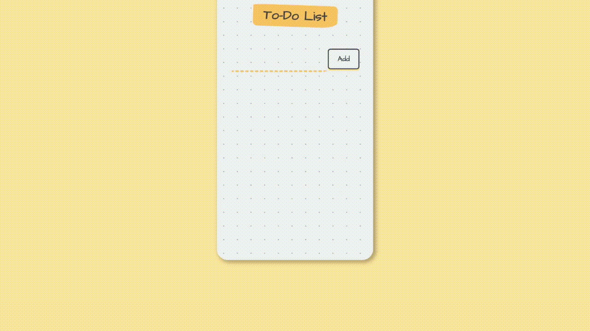

# [To-Do App: React.js Fundamentals](https://jacobgrisham.github.io/React.js-Fundamentals/)
### Coding challenge from the Udemy Course [the Complete 2020 Web Developer Bootcamp](https://www.udemy.com/course/the-complete-web-development-bootcamp/)
I wrote the code in App.jsx and InputArea.jsx. The other files were provided by the instructor.



## 💡Lessons Learned
- React component tree management
- ES6 Spread Operator

## 🚀 Getting Started
To run this project locally:
- In your terminal, navigate to the root folder and run the following commands
```
$ npm install
$ npm start
```

## 🕹 How to Use
Enter your text above the yellow dotted line and click "Add". To delete a list-item, click on the corresponding text.

## 📣 Reference
- Section 33: React.js of the Udemy Course [the Complete 2020 Web Developer Bootcamp](https://www.udemy.com/course/the-complete-web-development-bootcamp/)